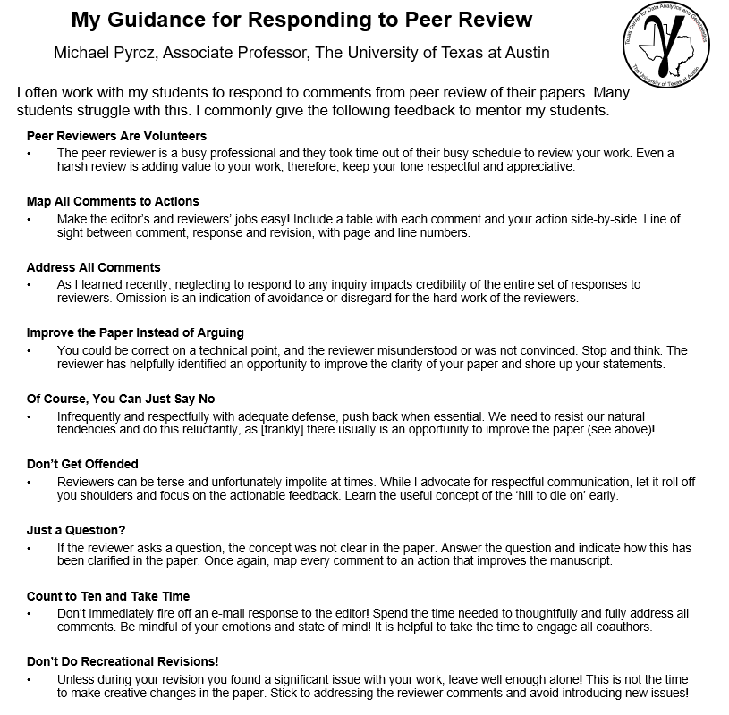

# Research and Computing Resources

## Computing

#### General Computing

* We've prepared a summary of the [workflow](https://sfustatgen.github.io/resources/workflow.pdf) for [open science](https://en.wikipedia.org/wiki/Open_science) used in our research group.
<!-- * These days we do most of our computationally-demanding work on [Compute Canada](https://computecanada.ca). -->
See our [Compute Canada introduction](https://sfustatgen.github.io/resources/computecan.html) page for information on registering with Compute Canada and using their
resources.
* [GitHub](https://github.com) is an essential tool for code development and collaboration based on a version control system called git. The [Pro Git](https://git-scm.com/book/en/v2) online book is the user manual for git and GitHub. Most of us use the RStudio/git interface, which can be set up in RStudio as described in [this document](https://support.rstudio.com/hc/en-us/articles/200532077-Version-Control-with-Git-and-SVN). See our [Git with RStudio](https://sfustatgen.github.io/resources/GitRStudioDoc.pdf) documentation for tips on resolving conflicts that can arise when working with collaborators and a general introduction to working with git in RStudio. -->
* The Department's [computing resources](https://www.sfu.ca/stat-actsci/research/research-resources/computing-research.html) webpage gives information on getting help at SFU, access to our Unix network, and links to software that is available to SFU faculty, staff and students.
* Advice on scientific computing for [beginners](https://journals.plos.org/ploscompbiol/article?id=10.1371/journal.pcbi.1005510) and more [advanced](https://journals.plos.org/plosbiology/article?id=10.1371/journal.pbio.1001745) users, from the people who developed the [Software and Data Carpentry](https://carpentries.org/) workshops.

#### Simulating Genomic Data

* Dick Hudson's [ms program](http://home.uchicago.edu/rhudson1/source/mksamples.html)
* [fastsimcoal2](http://cmpg.unibe.ch/software/fastsimcoal2)
* [msprime](https://tskit.dev/msprime/docs/stable/intro.html): a Python package for simulation
that uses a novel "succinct tree sequences" data structure to efficiently
store the ancestral history of a set of DNA sequences. See also:
    * Payman Nickchi's [tutorial materials](https://github.com/paymannickchi/msprime) 
    on GitHub and [command-line demo](https://www.sfu.ca/content/dam/sfu/stat/documents/Statgen/mspcommands.txt)
    * Documentation for the [tskit](https://tskit.dev/tskit/docs/stable/) Python package that implements the "succinct tree sequences" data structure that underlies msprime.
* [SLiM](https://messerlab.org/slim/)

#### Computing with R

* [RStudio](https://www.rstudio.com/) is an interface, or ["integrated development environment (IDE)"](https://en.wikipedia.org/wiki/Integrated_development_environment) for R
*  <a href="https://www.sfu.ca/content/dam/sfu/stat/documents/Statgen/DIYRpackage.pdf">Creating R packages with RStudio and roxygen2</a>, by Christina Nieuwoudt, based on the evolving online textbook [R packages](https://r-pkgs.org/) by Hadley Wickham and Jenny Bryan. 
* <a href="https://www.sfu.ca/content/dam/sfu/stat/documents/Statgen/ParallelComputing_inR_CC.pdf">Parallel Computing in R with WestGrid</a>, by Bhagya Karunarathna.
* Hadley Wickham's [Advanced R](https://adv-r.hadley.nz/) textbook includes useful information on
    * [debugging](https://adv-r.hadley.nz/debugging.html)
    * [profiling](https://adv-r.hadley.nz/perf-measure.html)
    * [optimizing](https://adv-r.hadley.nz/perf-improve.html) and
    * [integrating C++](https://adv-r.hadley.nz/rcpp.html) using [Rcpp](http://www.rcpp.org/). 

#### Computing with C/C++

* Our group uses the GNU tools, such as the gcc C compiler and the g++ C++ compiler, for software development. How you [access these tools](resources/Ctools.html) depends on your operating system
* The [GNU Scientific Library](https://www.gnu.org/software/gsl/) includes implementations of **many** common scientific functions that you can include in your C or C++ programs. This extensive library includes functions for summary statistics, vectors and matrices, random number generation, linear algebra, Monte Carlo integration and more.

#### Computing with Python

* [Getting started](https://www.python.org/about/gettingstarted/)
* [Documentation](https://www.python.org/doc/)
* [Integrated development environments](https://wiki.python.org/moin/IntegratedDevelopmentEnvironments)

## Responding to reviewers 

Some tips from Michael Pyrcz, U. of Texas Austin:

<h2>TeX/LaTeX 
</h2>
<ul>
<li>Templates for SFU Master's projects and PhD theses in LaTeX.<ul>
<li>&nbsp;<a href="http://www.lib.sfu.ca/help/publish/thesis/templates#latex-template">LaTeX template</a> from the SFU Library. 
</li>
<li>A BibTeX sytle file forwarded by Flora Qu: <a href="https://www.sfu.ca/content/dam/sfu/stat/documents/Statgen/jasasty-ay.bst">jasasty-ay.bst</a>. The &quot;ay&quot; in the name appears to refer to &quot;author-year&quot; style references [e.g. Qu (2009)], rather than numeric citations in the text. Flora reports having had trouble with other bibtex style files, but that this one works. She notes: &quot;When you use this bib style file, you need to add \usepackage{natbib} in the main tex file.&quot;</li>
<li>In addition to the LaTeX files, MSc students may be interested in looking at a few recent projects from the department to get sense of the scope and size of a typical MSc project: (i) <a href="https://www.sfu.ca/content/dam/sfu/stat/alumnitheses/2015/chenlu%20shi_finalproject.pdf">Chenlu Shi</a>, (ii) &nbsp;<a href="https://www.sfu.ca/content/dam/sfu/stat/alumnitheses/2014/MSc%20Project%20Report%20-%20Kunasekaran%20Nirmalkanna.pdf">Kunasekaran Nirmalkanna</a>, (iii) &nbsp;<a href="https://www.sfu.ca/content/dam/sfu/stat/alumnitheses/2014/RachelLipson%20Final%201141.pdf">Rachel Lipson</a></li>
</ul>
</li>
<li>LaTeX posters:<ul>
<li>The package tizkposter is popular these days.<ul>
<li>Download the LaTeX package <a href="https://mirrors.ctan.org/graphics/pgf/contrib/tikzposter.zip">zipfile</a>,</li>
<li>use unzip to unpack it into its own directory,</li>
<li>change to this directory and run &quot;latex tikzposter.ins&quot; to generate the class files and examples.</li>
<li>The documentation file is tikzposter.pdf. An example poster is in the file tikzposter-example.tex. A template that you can use as a starting point for your own posters is in the file tizkposter-template.tex.</li>
</ul>
</li>
<li>Another possibility is the beamerposter package, which you may prefer over tikzposter if you use beamer for presentations.<ul>
<li>Downoad the LaTeX package <a href="https://mirrors.ctan.org/macros/latex/contrib/beamerposter.zip">zipfile</a>,</li>
<li>use unzip to unpack it into its own directory and change to this directory.</li>
<li>The documentation is in the file beamerposter.pdf, and an example is in the file example.tex.</li>
</ul>
</li>
</ul>
</li>
<li>Poster printing at Cornerstone Printing at SFU:
<ul>
<li>$4.49/ sq. ft for regular paper, $5.49/ sq. ft for thicker glossy paper and $7.49/sq. ft for fabric (can be folded)</li>
<li>they say they need 1 business day, but in our experience they can do it in one dat</li>
</ul>
</ul>

## Old documents and resources

* See [here](resources/olddocs.html) for other, possibly out-dated, resources
